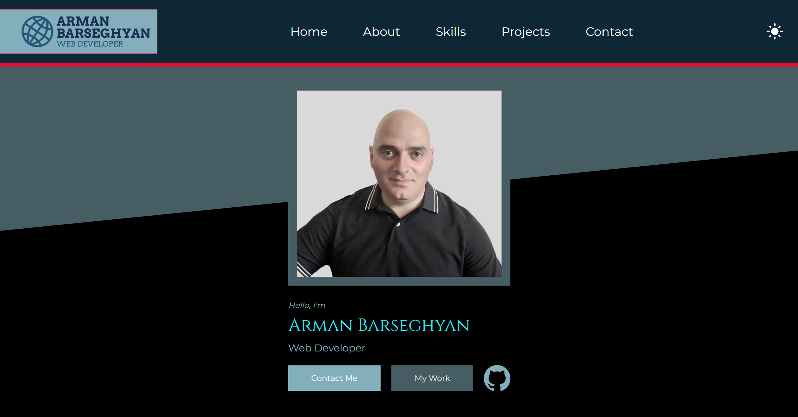
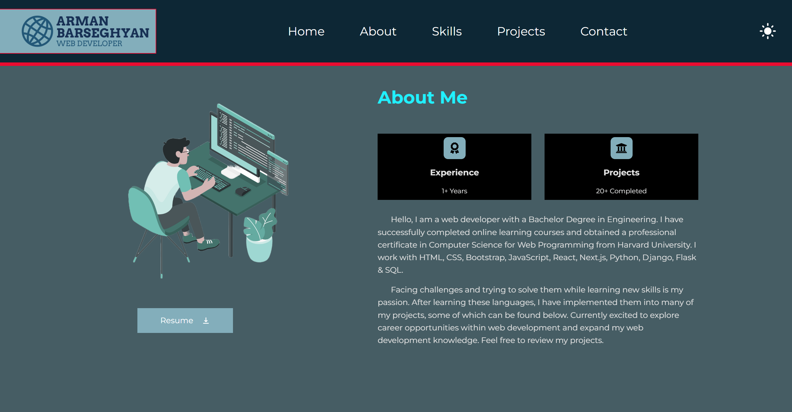
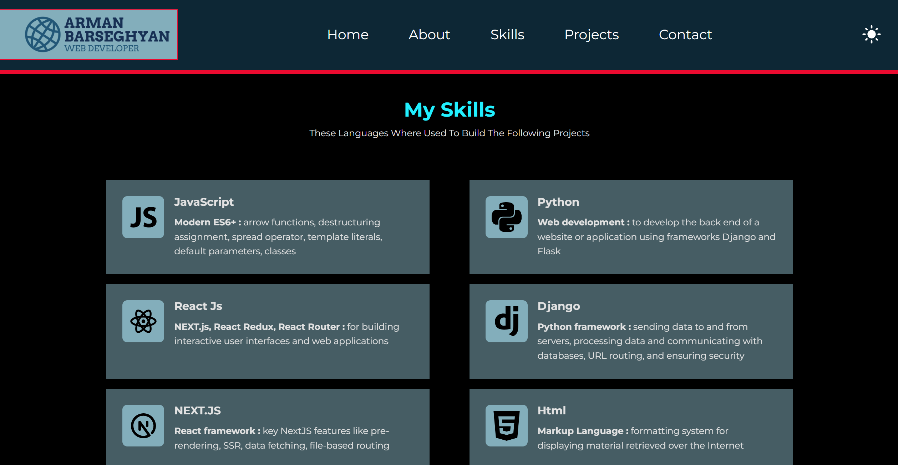
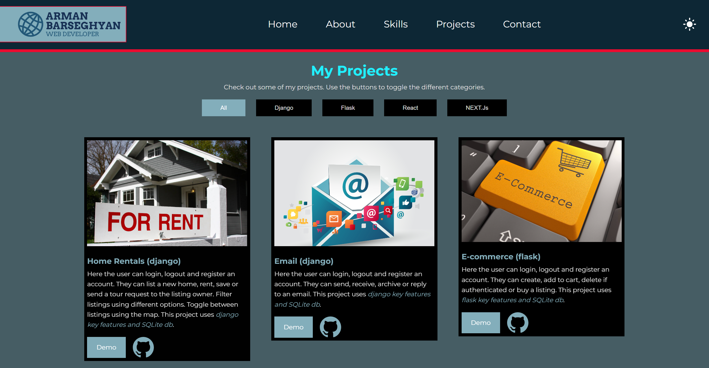
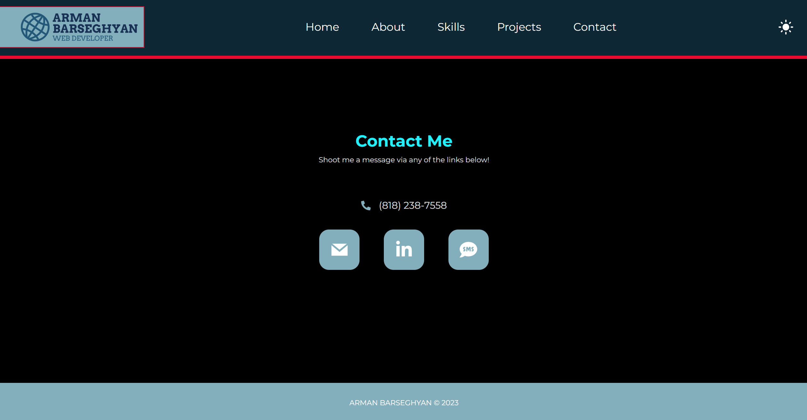

# Portfolio

## Description
This is a website built to showcase my technical skills, web design skills, and projects.

## Technologies Used
- HTML
- CSS
- JavaScript (ES6)
- React

## Usage
Use the navbar buttons to navigate between the sections or scroll to the section needed. For mobile screens, use the floating navbar to navigate between the sections. The button on the right side of the navbar is for toggling between dark and light modes. 

### Go to [Portfolio](https://armanbarseghyan83.github.io/portfolio/)

Home page

About Me page

My Skills page

My Projects page

Contact Me page

## Questions
### Use the links below if you have any questions.
- Email Address - [armanbarseghyan83@gmail.com](mailto:armanbarseghyan83@gmail.com)
- Linkedin - [https://www.linkedin.com/in/arman-barseghyan](https://www.linkedin.com/in/arman-barseghyan)
- GitHub Profile - [https://github.com/ArmanBarseghyan83](https://github.com/ArmanBarseghyan83)
